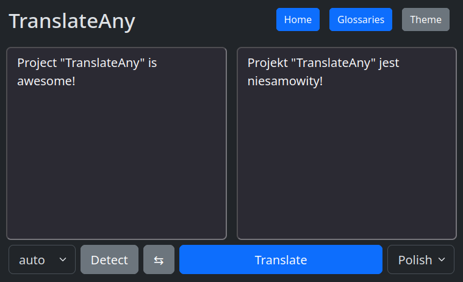

# TranslateAny

TranslateAny is a project that turns any OpenAI compatible system (and more!) into translate engine, exposing API compatible with Google Translate, DeepL and LibreTranslate.

# Usage

> **_NOTE:_** Before you start, [configure your application](#configuration).

```
git clone https://github.com/aazsamir/translateany.git
cd translateany
cp .env.example .env
docker compose up
```
or
```
git clone https://github.com/aazsamir/translateany.git
cd translateany
cp .env.example .env
composer install
./tempest serve --host=0.0.0.0 --port=8000
```

using `docker`
```
docker run \
  --rm \
  --add-host=host.docker.internal:host-gateway \
  -p 8000:80 \
  -e TRANSLATE_ANY_HOST=http://host.docker.internal:11434/v1 \
  -e TRANSLATE_ANY_MODEL=hf.co/bartowski/aya-expanse-8b-GGUF:IQ4_XS \
  aazsamir/translate-any:latest
```
> **_NOTE:_** Use `TRANSLATE_ANY_HOST` and `TRANSLATE_ANY_MODEL` environment variables to easily configure TranslateAny running in docker, or pass `/var/www/html/config/app.config.php` config file during build or as a volume. By default they are set to `http://host.docker.internal:11434/v1` and `hf.co/unsloth/gemma-3-12b-it-GGUF:IQ4_XS` model.

Now, on `http://localhost:8000` you can test your configuration in playground.

Or use `translate` command to test your configuration.

Using shell
```shell
./tempest translate --text="Hello world" --target="pl"
```
Using docker compose:
```shell
docker compose run --rm translateany php tempest translate --text="Hello world" --target="pl"
```



# Configuration

## Configuration builder wizard

If you aren't familiar with PHP try configuration builder wizard.

```shell
php tempest create-config
```

If you don't have `php` installed, use `docker compose` to run wizard.
```shell
docker compose run --rm translateany php tempest create-config
```

## Manual configuration

Copy `app/Config/app.config.php.example` to `app/Config/app.config.php`.
```php
// app/Config/app.config.php
use App\Engine\Chat\ChatEngine;
use App\Engine\OpenAI\OpenAIClient;
use App\System\AppConfig;

return new AppConfig(
    translate: ChatEngine::new(
        client: OpenAIClient::new(
            host: 'http://localhost:11434/v1',
            // or if you are using docker-compose 
            // host: 'http://host.docker.internal:11434/v1', 
            model: 'qwen3:14b',
        ),
    ),
);
```

You may use different engines depending on target language by wrapping them in `RouteEngine`.
```php
// app/Config/app.config.php
use App\Engine\Chat\ChatEngine;
use App\Engine\OpenAI\OpenAIClient;
use App\Engine\Route\RouteEngine;
use App\Engine\Route\TranslateRoute;
use App\System\AppConfig;
use App\System\Language;

return new AppConfig(
    translate: RouteEngine::new(
        TranslateRoute::new(
            engine: ChatEngine::new(
                client: OpenAIClient::new(
                    model: 'Bielik-11B-v2.3:IQ4_XS'
                ),
            ),
            languages: [
                Language::en
            ],
        ),
        TranslateRoute::new(
            engine: ChatEngine::new(
                client: OpenAIClient::new(
                    model: 'qwen3:14b',
                ),
            ),
        ),
    ),
);
```

Depending on your needs, you may want to cache the translation results. You can do this by using `CacheEngine`
```php
// app/Config/app.config.php
use App\Engine\Cache\CacheEngine;
use App\Engine\Chat\ChatEngine;
use App\Engine\OpenAI\OpenAIClient;
use App\System\AppConfig;

return new AppConfig(
    translate: CacheEngine::new(
        engine: ChatEngine::new(
            client: OpenAIClient::new(),
        ),
        cacheMinutes: 5,
    ),
);
```

To access language detection, configure `detection` in `app/Config/app.config.php`:
```php
// app/Config/app.config.php
use App\Engine\Chat\ChatDetectEngine;
use App\Engine\OpenAI\OpenAIClient;
use App\System\AppConfig;

return new AppConfig(
    detection: ChatDetectEngine::new(
        client: OpenAIClient::new(),
    ),
);
```

If you are using Ollama and need better control over the model, use `OllamaClient`.
```php
// app/Config/app.config.php
use App\Engine\Chat\ChatEngine;
use App\Engine\Ollama\OllamaClient;
use App\Engine\Ollama\OllamaSettings;
use App\System\AppConfig;

return new AppConfig(
    translate: ChatEngine::new(
        client: OllamaClient::new(
            model: 'qwen3:14b',
            settings: OllamaSettings::new(
                minP: 0.1,
                temperature: 0.4,
                stop: ["\n"],
            ),
        ),
    ),
);
```

You can use [translateLocally](https://github.com/XapaJIaMnu/translateLocally) for Marian/Bergamot models.
Set `TranslateLocallyEngine` and provide a path to binary.
```php
// app/Config/app.config.php
use App\Engine\TranslateLocally\TranslateLocallyEngine;
use App\System\AppConfig;

return new AppConfig(
    translate: TranslateLocallyEngine::new(
        binPath: '/usr/local/bin/translateLocally',
        defaultModel: 'en-pl-tiny',
    ),
);
```

### Authorization

For simple authorization just set `TRANSLATE_ANY_TOKEN` environment variable. If you don't want authorization at all, don't set it or leave it empty.

# API

TranslateAny exposes schema from different translation providers and differentates them by path prefix.
> **_NOTE:_** Not all endpoints are exposed right now, for example: document translation isn't handled.

|Engine|Method|Original|TranslateAny|
|---|---|---|---|
|**Google Translate V2**|**POST**|**`/language/translate/v2`**|**`/google/v2/language/translate/v2`**|
|Google Translate V2|POST|`/language/translate/v2/detect`|`/google/v2/language/translate/v2/detect`|
|Google Translate V2|GET|`/language/translate/v2/languages`|`/google/v2/language/translate/v2/languages`|
|**DeepL**|**POST**|**`/v2/translate`**|**`/deepl/v2/translate`**|
|DeepL|GET|`/v2/languages`|`/deepl/v2/languages`|
|DeepL|GET|`/v2/glossary-language-pairs`|`/deepl/v2/glossary-language-pairs`|
|DeepL|POST|`/v2/glossaries`|`/deepl/v2/glossaries`|
|DeepL|GET|`/v2/glossaries/{glossary_id}`|`/deepl/v2/glossaries/{glossary_id}`|
|DeepL|GET|`/v2/glossaries/{glossary_id}/entries`|`/deepl/v2/glossaries/{glossary_id}/entries`|
|DeepL|DELETE|`/v2/glossaries/{glossary_id}`|`/deepl/v2/glossaries/{glossary_id}`|
|**DeepLX**|**POST**|**`/translate`**|**`/deeplx/translate`**|
|**DeepLX**|**POST**|**`/v1/translate`**|**`/deeplx/v1/translate`**|
|**LibreTranslate**|**POST**|**`/translate`**|**`/libre/translate`**|
|LibreTranslate|POST|`/detect`|`/libre/detect`|
|LibreTranslate|GET|`/languages`|`/libre/languages`|

# Features
- ✅ OpenAI Compatible API Translation Engine
- ✅ LibreTranslate Translation Engine
- ✅ Native Ollama Translation Engine
- ✅ Bergamot (Marian) Translation Engine, thanks to [translateLocally](https://github.com/XapaJIaMnu/translateLocally)
- ❌ Native Llama.cpp Translation Engine
- ❌ Native vLLM Translation Engine
- ❌ Google Translate Translation Engine
- ❌ DeepL Translation Engine
- ✅ DeepL API
    > **_NOTE:_** Currently missing `/v2/write/rephrase` endpoint
- ✅ DeepLX API
- ✅ Google Translate v2 API
- ❌ Google Translate v3 API
- ✅ LibreTranslate API
- ✅ Language Detection
- ❌ Rephrasing
- ✅ API authorization
- ❌ Document Translation
- ⚠️ HTML Playground to test integration
    > **_NOTE:_** This is a work in progress, and not all features are possible to test. Basic translation is available.
- ❌ Examples of integration with other projects, like SillyTavern

# License

This project is licensed under the MIT License.
